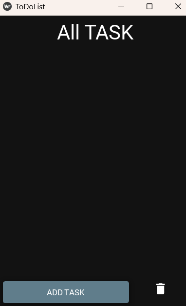

# KivyMD ToDo App

A simple and elegant ToDo list application built with KivyMD framework featuring a dark theme and persistent task storage.

## Features

- ✅ **Add Tasks** - Create tasks with title and detailed descriptions
- 🗑️ **Delete Tasks** - Remove completed or unwanted tasks
- 🎯 **Task Selection** - Click to select tasks before deletion
- 💾 **Auto-Save** - Tasks automatically saved to JSON file
- 🌙 **Dark Theme** - Modern dark UI with BlueGray color palette
- 📱 **Mobile-Friendly** - Optimized for mobile screen sizes

## Screenshots



## Installation

### Prerequisites
```bash
pip install kivymd
pip install kivy
```

### Clone & Run
```bash
git clone https://github.com/mshivam017/kivymd-todo-app.git
cd kivymd-todo-app
python main.py
```

## Usage

1. **Add Task**: Click "ADD TASK" button, enter title and details
2. **Select Task**: Tap on any task to select it (highlighted in gray)
3. **Delete Task**: Select a task and click the delete icon
4. **Tasks Auto-Save**: All changes are automatically saved to `tasks.json`

## File Structure

```
kivymd-todo-app/
├── main.py          # Main application file
├── tasks.json       # Task storage (auto-generated)
├── README.md        # This file
```

## Technical Details

- **Framework**: KivyMD 1.0+
- **Storage**: JSON file-based persistence
- **Theme**: Dark mode with BlueGray palette
- **Layout**: Responsive BoxLayout with ScrollView
- **Window Size**: 320x480 (mobile optimized)

## Code Highlights

- Clean MVC architecture
- Error handling for file operations
- Dynamic UI updates
- Memory-efficient task management

## Future Enhancements

- [ ] Task completion status
- [ ] Due dates and reminders
- [ ] Task categories/tags
- [ ] Search and filter
- [ ] Task editing
- [ ] Export options

## Contributing

1. Fork the repository
2. Create feature branch (`git checkout -b feature/AmazingFeature`)
3. Commit changes (`git commit -m 'Add AmazingFeature'`)
4. Push to branch (`git push origin feature/AmazingFeature`)
5. Open a Pull Request

## License

This project is licensed under the MIT License - see the [LICENSE](LICENSE) file for details.

## Author

**Shivam Mishra**
- GitHub: [@shivammishra](https://github.com/mshivam17)

---

⭐ **Star this repo if you found it helpful!**